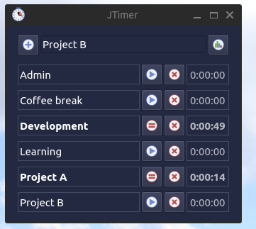

# John's Timer - python desktop time tracker

[](https://github.com/johnw-dev/jtimer/actions/workflows/main.yml)
[](https://badge.fury.io/py/jtimer)

Dissatisfied with the selection of timer applications available in linux, I built my own.  It maintains a simple local db in the user's home directory

The application is fairly simple:
* user can specify a list of different timers.
* timers can be renamed.
* timers can be started / stopped concurrently.
* on startup the timers will resume the count from the last start event.
* timers should not cross over days. the app will automatically stop timers at 23:59:59 for any forgotten timers left running.
* daily statistics view



## Installation
```bash
pip install jtimer
```

## Usage
```bash
jtimer
```

## Planned Future developments

* timer linked triggers
* timer event modification view